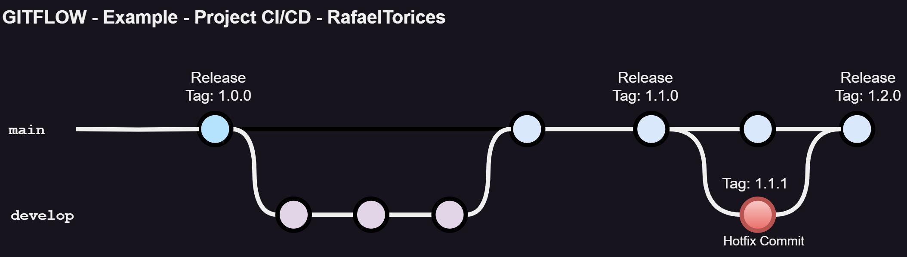

## Example CI/CD pipeline with CircleCI

### Author: RafaelTorices

The repository uses the Gitflow workflow. The repository branches:

- **main**: Contains the stable code of the application.
- **develop**: Contains the code in development of the application.
- **release**: Contains the code of the releases of the application.

## CI/CD pipeline

The CI/CD pipeline is created using CircleCI. The pipeline definition is in the **.circleci/config.yml** file.
For use the pipeline, you need to create a project in CircleCI (https://app.circleci.com/) and link it to the repository Github.

In resume, the pipeline has the following steps:

- **Executors**: docker
- **Jobs**:

  - **app-build**: Build the application.
  - **app-test**: Testing the application.
  - **app-docs**: Generate the documentation of the application.
  - **app-release**: Release the application.
  - **app-deploy**: Deploy the application.

- **workflows**: app-workflow

  - **app-build**: Build the application.
  - **app-test**: Requires build. Test the application.
  - **app-docs**: Requires build. Generate the documentation of the application.
  - **app-release**: Requires build, test and docs. Release the application.
  - **app-deploy**: Requires build. Deploy the application.

- **artifacts**: Generated by the jobs.

  - **app-test**: The test coverage xml and html of the application for testing.
  - **app-docs**: The documentation html of the application for review.
  - **app-release**: The package tar.gz of the application for distribution.
  - **app-deploy**: The package dockerhub of the application for upload to DockerHub.

- **orbs**: Used in the pipeline:
  - **SonarCloud**: For the static code analysis.
  - **GitGuardian**: For the secrets detection.

The pipeline is triggered when:

- Commit is made to the **develop** branch
- Commit is made to the **release** branch
- Commit is made to the **main** branch.

The pipeline generates the following artifacts:

- Docker image of the application in DockerHub: https://hub.docker.com/repository/docker/rafacv99/pycalculator/general

> #### Note (SonarCloud)
>
> The pipeline contains a job for the static code analysis using SonarCloud and use the SonarCloud Orb. For use the SonarCloud Orb, you need to create a project in SonarCloud (https://sonarcloud.io/) and link it to the repository Github. Also, you need to create a token in SonarCloud and add it to the CircleCI environment variables with the name SONAR_TOKEN. The context must be indicated in the workflow jobs.
